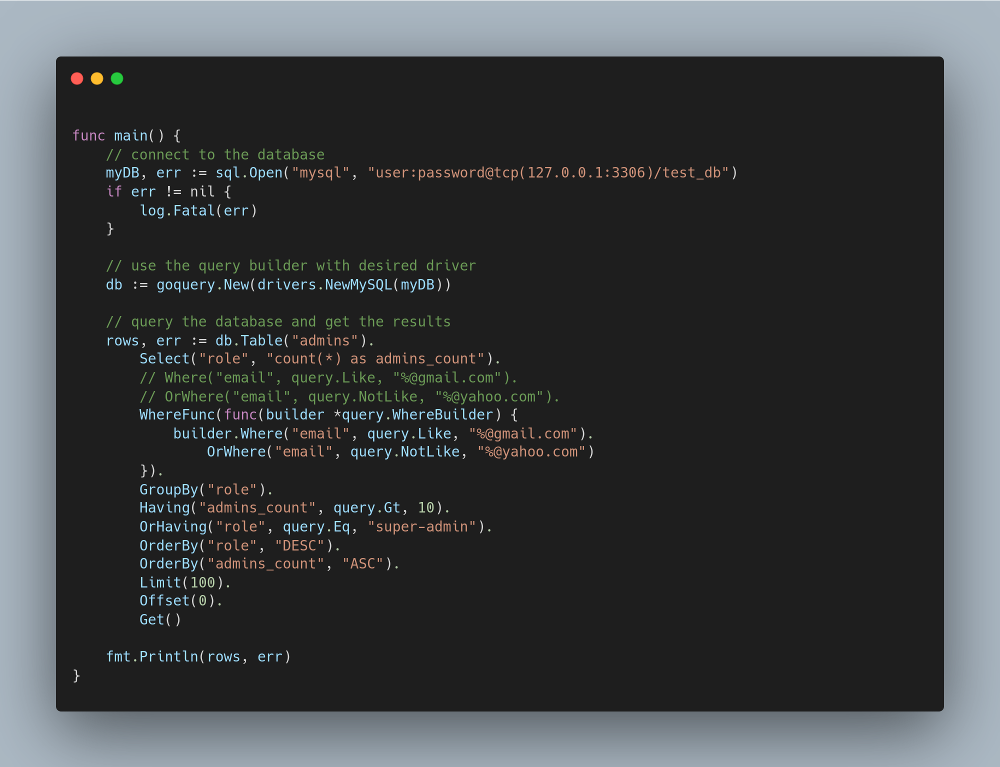

## goquery

**GoQuery** is a Golang query builder library inspired by Laravel's Query Builder, aims to support multiple drivers such as MySQL, PostgreSQL, and SQLite. It aims to simplify building SQL queries in Go without compromising flexibility and performance.

### Table of Contents

- [goquery](#goquery)
  - [Table of Contents](#table-of-contents)
  - [Features](#features)
  - [Installation](#installation)
  - [Usage](#usage)
    - [Basic Queries](#basic-queries)
      - [Example: Select](#example-select)
    - [Advanced Queries](#advanced-queries)
      - [Example: Join Query](#example-join-query)
    - [Transactions](#transactions)
    - [Aggregates](#aggregates)
    - [Raw Queries](#raw-queries)
  - [Drivers Support](#drivers-support)
  - [Contribution Guidelines](#contribution-guidelines)
  - [License](#license)
  - [TODO](#todo)

---

### Features

- Chainable API similar to Laravel's Query Builder.
- Multi-driver support: MySQL, PostgreSQL, and SQLite.
- Easily switch between SQL databases.
- Query transactions, joins, aggregates, and more.
- Raw queries for complex SQL statements.
- Easy-to-read, maintainable query construction.
- Built-in error handling.

### Installation

To install the package, use `go get` to download the package and add it to your project:

```bash
go get github.com/mohamed-samir907/goquery
```

### Usage

You can find the full API docs for the packahge [here](./docs/docs.md)

#### Basic Queries

You can start by using GoQuery to create simple queries such as `SELECT`, `INSERT`, `UPDATE`, and `DELETE`.

##### Example: Select

```go
package main

import (
	"fmt"
	"log"
	"github.com/mohamed-samir907/goquery"
    "github.com/mohamed-samir907/goquery/drivers"
)

func main() {
	db := goquery.New(drivers.NewMySQL(myDBConn))

	result, err := db.Table("users").Select("id", "name").Where("age", ">", 18).Get()
	if err != nil {
		log.Fatal(err)
	}

	for _, row := range result {
		fmt.Println(row["name"])
	}
}
```

#### Advanced Queries

GoQuery supports more advanced queries like `INNER JOIN`, `GROUP BY`, and subqueries.

##### Example: Join Query

```go
db := goquery.New(drivers.NewMySQL(myDBConn))

result, err := db.Table("users").
    Select("users.name", "orders.total").
    Join("orders", "users.id", "=", "orders.user_id").
    Where("users.age", ">", 18).
    Get()

if err != nil {
    log.Fatal(err)
}
```

#### Transactions

GoQuery supports SQL transactions to help ensure data consistency and handle complex database operations.

```go
db := goquery.New(drivers.NewMySQL(myDBConn))

tx, err := db.Begin()
if err != nil {
    log.Fatal(err)
}

// Perform operations within the transaction
result, err := tx.Prepared("INSERT INTO users (name) VALUES (?)", []any{"Mohamed Samir"})
if err != nil {
    tx.Rollback()
    log.Fatal(err)
}

result, err = tx.Table("users").Where("id", query.Eq, 1).First()
if err != nil {
    tx.Rollback()
    log.Fatal(err)
}

err = tx.Commit()
if err != nil {
    log.Fatal(err)
}
```

#### Aggregates

To use aggregate functions such as `COUNT`, `SUM`, `AVG`, etc.:

```go
db := goquery.New(drivers.NewMySQL(myDBConn))

count, err := db.Table("orders").Count()
if err != nil {
    log.Fatal(err)
}

fmt.Println("Total Orders: ", count)
```

#### Raw Queries

For more complex queries that cannot be constructed using the chainable API, raw queries are also supported:

```go
db := goquery.New(drivers.NewMySQL(myDBConn))

// you can use db.Unprepared("SELECT * FROM users WHERE id = 1")
result, err := db.Prepared("SELECT * FROM users WHERE age > ?", []any{18})
if err != nil {
    log.Fatal(err)
}
```

### Drivers Support

Currently, GoQuery supports the following drivers:

- MySQL
- PostgreSQL
- SQLite

Support for additional drivers can be added as needed.

### Contribution Guidelines

We welcome contributions to GoQuery! If you have any ideas or improvements, feel free to open an issue or submit a pull request.

1. Fork the repository.
2. Create a new feature branch.
3. Commit your changes.
4. Open a pull request.

### License

GoQuery is licensed under the MIT License. See the [LICENSE](./LICENSE) file for more details.

### TODO
- [ ] Add testing
- [ ] Add joins
- [ ] Add insert
- [ ] Add update
- [ ] Add Delete
- [ ] Add Upsert
- [ ] Add Raw queries execute
- [ ] Add aggregates
- [ ] Add transactions support
